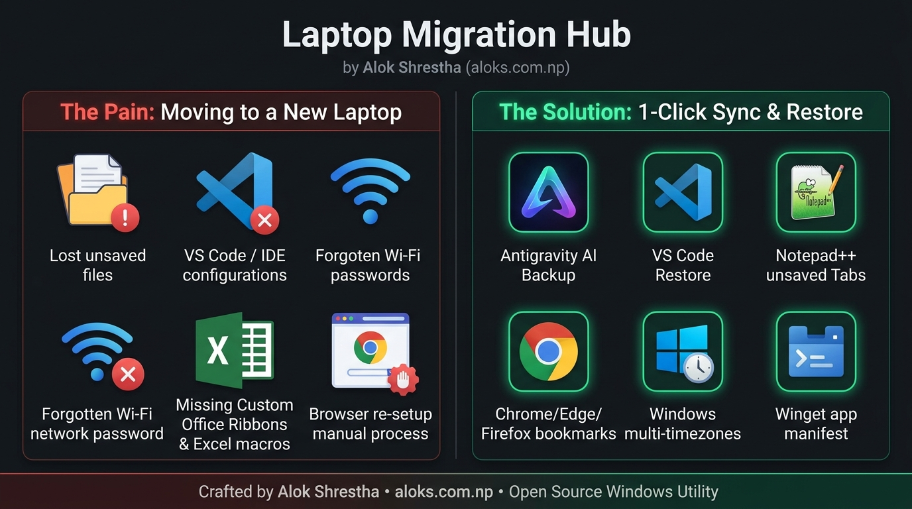
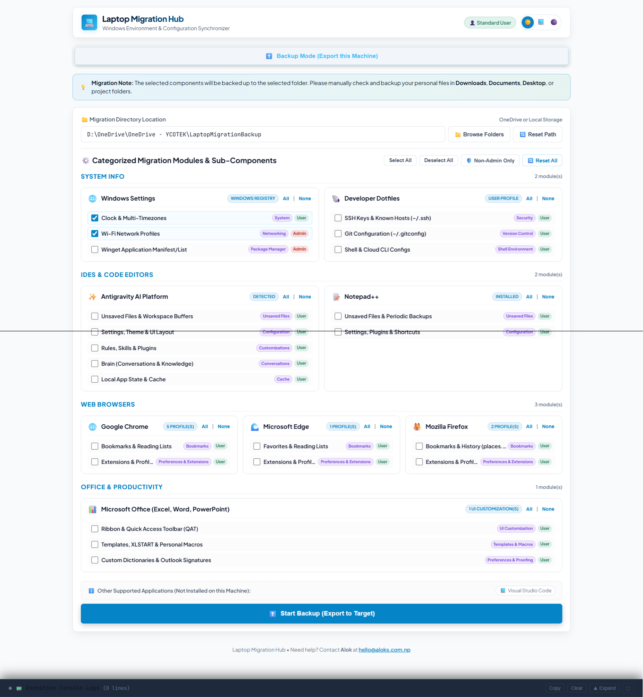
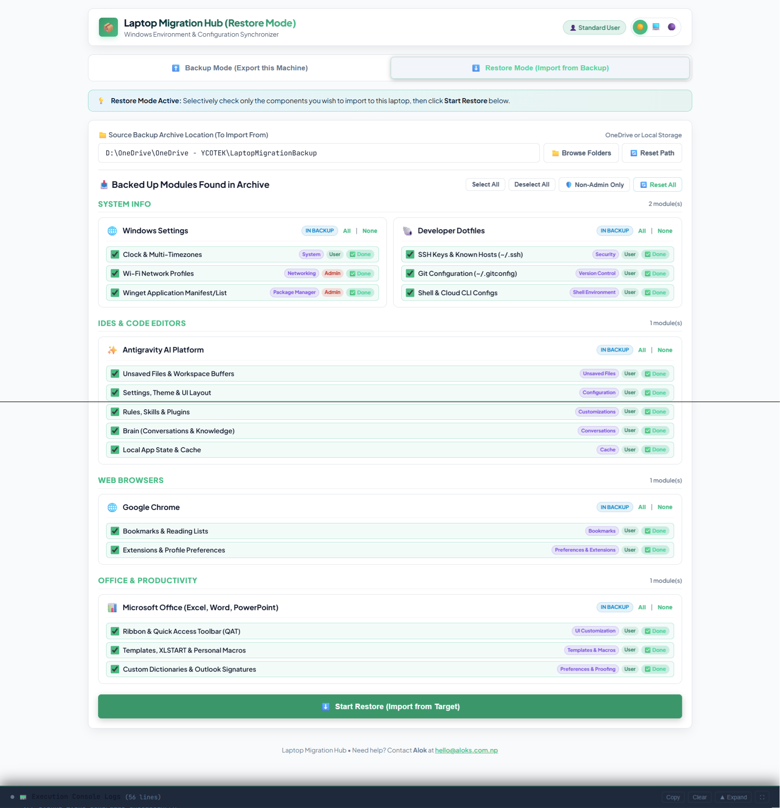

# Laptop Migration Hub 💻

[](https://github.com/aalooksth/laptop-migrator/releases)
[](LICENSE)
[](https://github.com/aalooksth/laptop-migrator)
[](https://www.python.org)
[](https://aloks.com.np)
[](https://github.com/aalooksth/laptop-migrator/actions)

An intelligent, modular Windows migration and configuration synchronizer. Back up and restore developer environments, dotfiles, shell configs, multiple timezone clock settings, Wi-Fi network profiles, Chrome/Edge/Firefox browser data, Antigravity AI / VS Code / Notepad++ unsaved files, workspaces, themes, & brains, Microsoft Office (Excel/Word/PowerPoint) ribbons & templates, and Winget application manifests seamlessly via OneDrive or any custom path.

Crafted with ❤️ by **[Alok Shrestha](https://aloks.com.np)** &bull; 🌐 [aloks.com.np](https://aloks.com.np) &bull; ✉️ [hello@aloks.com.np](mailto:hello@aloks.com.np)

---



---

## Key Highlights

- **3-Tier Modular Categorization**: Organizes items into **Software Category (Family) ➔ Software Module ➔ Sub-Item Function**.
- **Context-Aware Backup & Restore Modes**: Automatically inspects destination folders and switches into **Restore Mode** with filtered, available-only items.
- **Granular Selectivity**: Check or uncheck any individual component for both backup and restore.
- **Unsaved File Preservation**: Captures untitled scratch files, hot exits, and workspace state from Antigravity, VS Code, and Notepad++.
- **Theme & UI Layout Retention**: Activity Bar position, window geometry, color themes, font settings, and layout databases (`state.vscdb`, `*.officeUI`).
- **Interactive Directory Browser**: Browse drives, shortcuts, and parent folders with 1 click.
- **Real-Time Log Console Drawer**: Pullable bottom console with line counts, log copying, and file-based logging to `migration.log`.
- **Full-Spectrum Browser Support**: Multi-profile Google Chrome, Microsoft Edge, and Mozilla Firefox (both Roaming and Local profiles).

---

## 3-Tier Modular Categorization Hierarchy

### 1. 💻 IDEs & Code Editors

- **Antigravity AI Platform**:
  - `Unsaved Files & Workspace Buffers`: Active unsaved files, untitled scratch tabs, and hot exit backups (`AppData\Roaming\Antigravity IDE\Backups` and `User\workspaceStorage`).
  - `Settings, Theme & UI Layout`: User `settings.json` (Activity Bar position: top/side, theme colors, font size), `keybindings.json`, `globalStorage` (`state.vscdb` UI layout database), snippets, and local timeline history (`AppData\Roaming\Antigravity IDE\User`).
  - `Rules, Skills & Plugins`: Global custom skills, behavioral rules, and plugins (`~/.gemini/config`).
  - `Brain (Conversations & Knowledge)`: Transcripts, knowledge base, artifacts, and logs (`~/.gemini/antigravity-ide`).
  - `Local App State & Cache`: Runtime cache and staging (`AppData\Local\antigravity`).
- **Visual Studio Code**:
  - `Unsaved Files & Workspace Buffers`: Unsaved buffer backups and workspace storage (`AppData\Roaming\Code\Backups`).
  - `Settings, Theme & UI Layout`: `settings.json` (Activity Bar, Theme), `keybindings.json`, `globalStorage` (`state.vscdb`), snippets, and history (`AppData\Roaming\Code\User`).
  - `Extensions & Profile Sync`: Installed extension metadata (`~/.vscode/extensions`).
- **Notepad++**:
  - `Unsaved Files & Periodic Backups`: Unsaved document backups (`AppData\Roaming\Notepad++\backup`) and active session tabs (`session.xml`).
  - `Settings, Plugins & Shortcuts`: Preferences (`config.xml`), custom shortcuts (`shortcuts.xml`), syntax styling, and plugin configs.

### 2. 📊 Office & Productivity

- **Microsoft Office (Excel, Word, PowerPoint)**:
  - `Ribbon & Quick Access Toolbar (QAT)`: Custom ribbon tabs, user-defined action buttons, and Quick Access Toolbar layouts (`*.officeUI` and `*.qat` for Excel, Word, PowerPoint, Outlook in `AppData\Local\Microsoft\Office\`).
  - `Templates, XLSTART & Personal Macros`: Default templates (`Normal.dotm`), Excel personal macro workbooks (`XLSTART/PERSONAL.XLSB`), Word startup add-in templates (`Word/STARTUP`), and custom themes (`AppData\Roaming\Microsoft\Templates\`).
  - `Custom Dictionaries & Outlook Signatures`: User custom proofing dictionaries (`CUSTOM.DIC` in `AppData\Roaming\Microsoft\UProof`) and Outlook email signatures (`AppData\Roaming\Microsoft\Signatures`).

### 3. 🌐 Web Browsers

- **Google Chrome** (Multi-profile):
  - `Bookmarks & Reading Lists`: Saved bookmarks across all user profiles (`Default`, `Profile 1..N`).
  - `Extensions & Profile Preferences`: Extension local/sync settings, sessions, and profile preferences.
- **Microsoft Edge** (Multi-profile):
  - `Favorites & Reading Lists`: Saved favorites across all profiles.
  - `Extensions & Profile Preferences`: Extension data and browser settings.
- **Mozilla Firefox** (Multi-profile):
  - `Bookmarks & History`: Places database (`places.sqlite`, `favicons.sqlite`).
  - `Extensions & Profile Preferences`: User preferences (`prefs.js`) and extension data.

### 4. 🌐 System Info

- **Windows Settings**:
  - `Desktop Wallpaper`: Active transcoded wallpaper image file and background registry style configuration (reloaded dynamically on restore).
  - `File Explorer Settings`: Explorer options including showing hidden files and showing file extensions (refreshed dynamically on restore).
  - `Clock & Multi-Timezones`: Additional clocks (`HKCU\Control Panel\TimeDate\AdditionalClocks` e.g., AEST, CST), international formatting, and system timezone.
  - `Wi-Fi Network Profiles`: Saved Wi-Fi network keys and connection profiles (`netsh` WLAN).
  - `Winget Application Manifest/List`: Automated software inventory export and reinstallation manifest (`winget export`).
- **Developer Dotfiles**:
  - `SSH Keys & Known Hosts`: Keypairs and client configs (`~/.ssh`).
  - `Git Configuration`: Global git settings (`~/.gitconfig`, `.gitignore_global`).
  - `Shell & Cloud CLI Configs`: Profiles in `~/.config`, `~/.bashrc`, `~/.zshrc`, `~/.aws`, `~/.kube`.

---

## Screenshots




---

## Migration Workflow Guide

### Step 1: Exporting from Old Laptop

1. Launch the Laptop Migration Hub.
2. Select your destination directory (defaults to OneDrive).
3. Choose the components you want to back up (or click **Select All**).
4. Click **⬆️ Start Backup (Export to Target)**.
5. Review the post-backup completion popup summary.

### Step 2: Restoring on New Laptop

1. Install your core applications on the new machine (you can use `winget import -i Applications\winget-packages.json`).
2. Open Laptop Migration Hub on the new machine.
3. Select your backup folder using **📁 Browse Folders**.
4. The dashboard will automatically detect the backup and switch to **Restore Mode**, displaying only the components present in your archive.
5. Check the items you wish to import and click **⬇️ Start Restore (Import from Target)**.
6. Restart your applications to apply restored configurations.

---

## Installation & Running

### Option A: Python / Source Code
```powershell
# Install dependencies
pip install -r requirements.txt

# Start dashboard
python app.py
```

### Option B: Standalone Executable (No Python Required)
Run the local build script:
```powershell
.\build.ps1
```
Or download the pre-compiled `LaptopMigrator.exe` from GitHub Releases.

---

## About the Author & Support

- **Created by**: **Alok Shrestha**
- **Website**: [https://aloks.com.np](https://aloks.com.np)
- **Email**: [hello@aloks.com.np](mailto:hello@aloks.com.np)
- **Feedback & Support**: For questions, suggestions, or issues, feel free to reach out via email or submit a GitHub issue.
